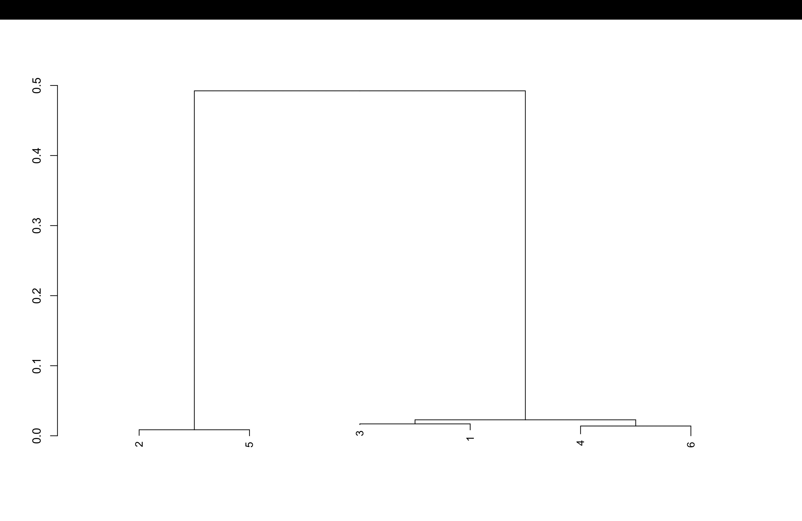

# BIO 410 Final Project
## Background
The dataset includes 6 samples from the Ebola virus, which is part of the filovirus family and can cause Ebola disease, a severe and sometimes fatal illness in humans. According to the Centers for Disease Control and Prevention, Ebola disease is caused by orthoebolaviruses that are mostly found in sub-Saharan Africa and are known to cause serious infections (Centers for Disease Control and Prevention, 2026).  https://www.cdc.gov/ebola/about/index.html
## Purpose
The purpose of this project was to create a phylogenetic tree from 6 samples of _Ebola___________ in order to determine the evolutionary relationships between the samples.

## Methods
The information for this project came from next-generation sequencing data collected from 6 Ebola virus samples. Next-generation sequencing creates a large number of short DNA sequences called reads. These reads were used to study how similar or different the Ebola virus samples were from one another. First, the short reads were assembled into longer DNA sequences called contigs using a program called MEGAHIT. MEGAHIT works by joining overlapping reads together to make longer sequences, which helps make comparisons between samples easier.

After the contigs were created, they were imported into RStudio and analyzed with the DECIPHER package. The sequences were aligned so matching sections could be compared across all 6 samples. This alignment step helped show the genetic differences more clearly. Once the alignment was finished, a phylogenetic tree was built using the maximum likelihood method in DECIPHER. This approach predicts the evolutionary tree that best explains the relationships between the samples. The completed tree was then used to determine which Ebola virus samples were the most closely related and which were more genetically different from each other.
The assembles reads are located in (abrahem Final Project.html) and the raw sequencing reads are located in abrahem.zip
## Results

Here is the phylogenetic tree:
(Insert the image, see the markdown cheat sheet for how to do that)

Explain
- which samples are closely related to each other
- how many individuals did these 6 samples come from (probably) based on the phylogenetic tree

